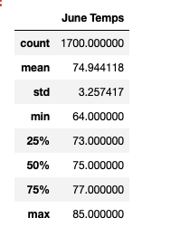
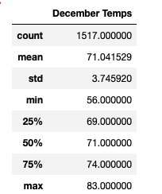

# surfs_up

## Overview of the Project 

### Purpose 

Running analytics on weather data to invest in Surf’s and Shakes store in Hawaii.
we use climate_analysis.ipynb jupyter notebook to do the initial analysis. 
The weather data is stored in SQLite database file called hawaii.sqlite and it has measurement and stations as their tables. 

### Initial analysis 

The purpose of the initial analysis is to analyze the precipitation levels having the data that backs up Ohau as the place to set up surfs and shakes store. 

First, we analyzed the precipitation level for 12months by quering date and precipitation data and creating the dataframe of the results.Then, plotted the results in chronological order using matplotlib.

Next, we identified the  9 stations and analysis were made to find the active stations against precipitations. Using SQLALchemy we were able to group active stations and sort the count in descending order to get the most active stations. 

Last, calculated low,high and average temperatures for the temperature analysis and plotted the same for visualization.

Finally, created the APP using Flask so that the investors can view the analysis. 
The APP has 5 routes set up : welcome,precipitation data of 12 months period,active stations,monthly temperatures and statiscal analysis report.

[climate_analysis.ipynb](climate_analysis.ipynb) - Initial Analysis file for surfs-up.

[app.py](app.py) - App file

### Updated Analysis

The purpose of the updated analysis is to create statistical analysis of the temperatures, specifically the temperature data for the months of June and December in Ohau in order to help determine if the surf and ice-cream shop business is sustainable year-round. Analysis was made by creating a query that captures the temperatures for the June and December months, which can then be used to calculate average,minimum and maximum temperatures for the specified months. 

[SurfsUp_Challenge.ipynb](SurfsUp_Challenge.ipynb)

## Results

### June Temperature Analysis

Based on the analysis, there are 1700 observations for the June month over the period of 2010 to 2017. The average ,minimum and maximum temperatures are noted below. The standard deviation implies small spread across the temperature observations. This holds true as Ohau weather remains same with less fluctuationis during the month of June by considering  the time period analysis. 

### December Temperature Analysis 

Based on the analysis, there seems to have 1517 observations for the December month over the period of 2010 t0 2016 which implies some of the dates are misisng temperature recordings. The average,minimum and maximum temperatures are noted below and we can see that June and December  have close average,minimum and maximum values. 

## Summary

By observing the statistics summary of June and December ,we can conclude that temperatue patterns remain steady throughout the year. However, by quering through the precipitation would give the results which may significantly impact the business.by doing statistical summary on precipitation for the month of June and December would give us the better understanding of the overall weather pattern. 

one more option to consider would be quering through the active stations to check for the weather patterns. this will help narrow down the best location to open up the Surf's and Shakes store.

